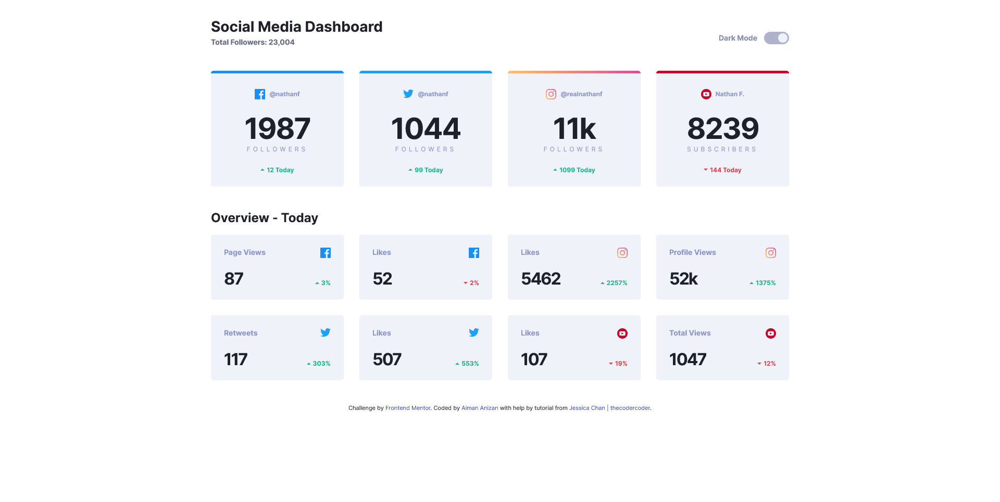

# Frontend Mentor - Social media dashboard with theme switcher solution

This is a solution to the [Social media dashboard with theme switcher challenge on Frontend Mentor](https://www.frontendmentor.io/challenges/social-media-dashboard-with-theme-switcher-6oY8ozp_H). Frontend Mentor challenges help you improve your coding skills by building realistic projects.
<br>
<br>

## **Table of contents**

-   [Overview](#overview)
    -   [The challenge](#the-challenge)
    -   [Screenshot](#screenshot)
    -   [Links](#links)
-   [My process](#my-process)
    -   [Built with](#built-with)
    -   [What I learned](#what-i-learned)
    -   [Useful resources](#useful-resources)
-   [Author](#author)
-   [Acknowledgments](#acknowledgments)

<br>
<hr>

## **Overview**

<br>

### **The challenge**

Users should be able to:

-   View the optimal layout for the site depending on their device's screen size
-   See hover states for all interactive elements on the page
-   Toggle color theme to their preference

<br>

### **Screenshot**

-   Dark Mode


-   Light Mode


<br>
<br>

### **Links**

-   Solution URL: [Add solution URL here](https://your-solution-url.com)
-   Live Site URL: [Frontend Mentor | Social Media Dashboard](https://aimananizan56.github.io/Socmed-Dashboard/)
<hr>

## **My process**

<br>

### **Built with**

-   Semantic HTML5 markup
-   CSS custom properties
-   SaSS
-   CSS Grid
-   Mobile-first workflow
    <br>

### **What I learned**

I had figure up that we can retrieve operating system color preference by using below code :

```js
if (window.matchMedia('(prefers-color-scheme: light)').matches) {
    lightButton.click();
}
```

This code will return boolean true when users set their operating system color to light. Otherwise, it will be returned as false.
<br>
<br>

I also found that I can store user website preference either dark or light using local storage as below code :

```js
localStorage.setItem('colorMode', 'dark');
```

To retrieve it, I use this code :

```js
if (localStorage.getItem('colorMode') == 'dark') {
    setDarkMode();
}
```

<br>

I also found some js function that could remove redundant code such as :

```js
const radioButtons = document.querySelectorAll('.toggle__wrapper input');
```

By using this, I could retrieve all radio buttons without using id. To add the event listener, I use loop since it returns all of the node list of element :

```js
for (let i = 0; i < radioButtons.length; i++) {
    radioButtons[i].addEventListener('click', (event) => {
        // code here
    });
}
```

<br>

### **Useful resources**

-   [A Complete Guide to Dark Mode on the Web](https://css-tricks.com/a-complete-guide-to-dark-mode-on-the-web/) - Help a lot when dealing with dark mode. Lots of alternative here.
<br>
<hr>

## **Author**

-   Frontend Mentor - [@AimanAnizan56](https://www.frontendmentor.io/profile/AimanAnizan56)
<br>
<hr>

## **Acknowledgments**

I would like to thank to [Jessica Chan | Coder Coder](https://www.youtube.com/c/TheCoderCoder/videos) youtube channel for this tutorial. I got a lot of knowledge by watching her video developing this solution. I also like her debugging method it feel calm and relax. I hope that one day I could be like her too.
